# 企业微信登录二维码获取技术研究

## 概述

本文深入研究企业微信登录二维码的获取技术，提供多种实现方案，包括逆向工程、文件监控和窗口截图等方法。

## 1. 二维码登录原理分析

### 1.1 登录流程概述

二维码登录是一种安全便捷的身份验证方式，其基本流程如下：

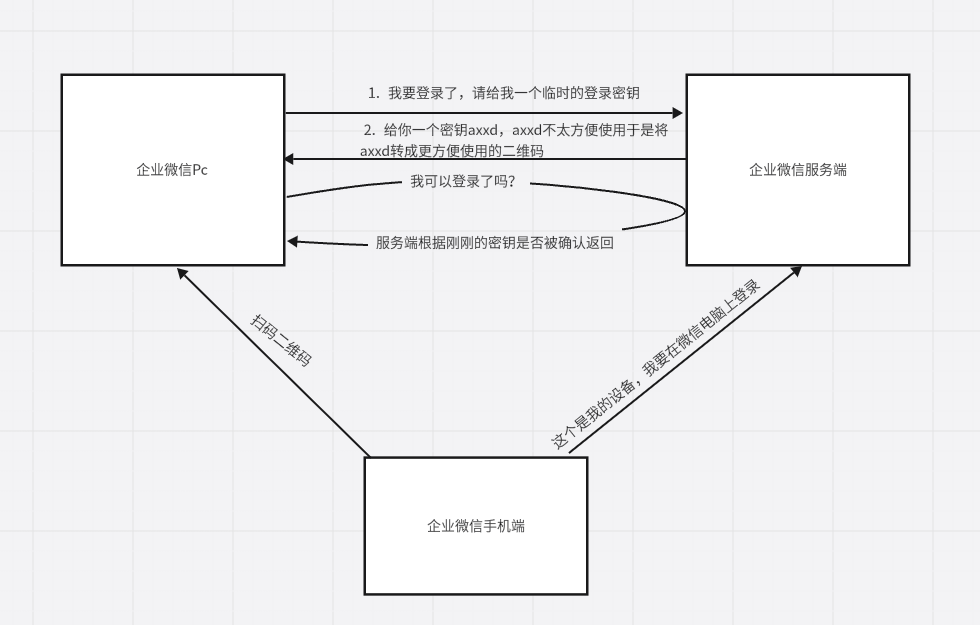

1. **临时密钥生成**：客户端向服务端请求获取登录的临时密钥
2. **二维码生成**：将密钥拼接成URL格式，生成二维码图像
3. **状态轮询**：客户端持续询问二维码登录状态
4. **移动端扫描**：用户使用移动端扫描二维码并解析内容
5. **授权确认**：移动端通过解析的数据向服务端发送授权请求
6. **状态更新**：服务端更改临时密钥状态为已授权
7. **登录完成**：客户端检测到授权状态后完成登录

### 1.2 技术要点分析

通过流程分析，我们可以得出以下关键信息：

1. **二维码本质**：二维码实际上是包含临时密钥的文本信息（URL + 密钥参数）
2. **密钥来源**：临时密钥通过网络请求从服务端动态生成
3. **二维码的展示**：二维码会作为图片展示到窗口给用户扫描使用

## 2. 技术实现方案

基于上述分析，本文提供三种主要的技术实现方案：

### 2.1 方案对比

| 方案 | 难度 | 稳定性 | 通用性 | 风险等级 |
| --- | --- | --- | --- | --- |
| 逆向工程 | 高 | 中 | 低 | 高 |
| 文件监控 | 中 | 高 | 中 | 低 |
| 窗口截图 | 低 | 高 | 高 | 低 |

### 2.2 逆向工程方案

### 2.2.1 方案原理

逆向工程方案基于以下思路：
1. 二维码内容本质上是文本信息（URL + 密钥参数）
2. 通过内存搜索定位密钥存储位置
3. 使用调试器分析密钥生成和更新过程

### 2.2.2 实施步骤

**步骤1：二维码内容解析**

首先通过在线二维码识别工具解析二维码中的原始内容：

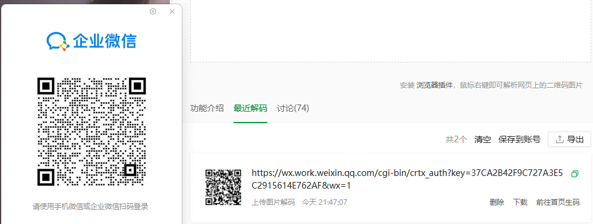

解析结果通常包含：
- 基础URL
- 临时密钥（key参数）
- 其他验证参数

**步骤2：内存搜索定位**

使用Cheat Engine等内存编辑工具搜索密钥字符串：

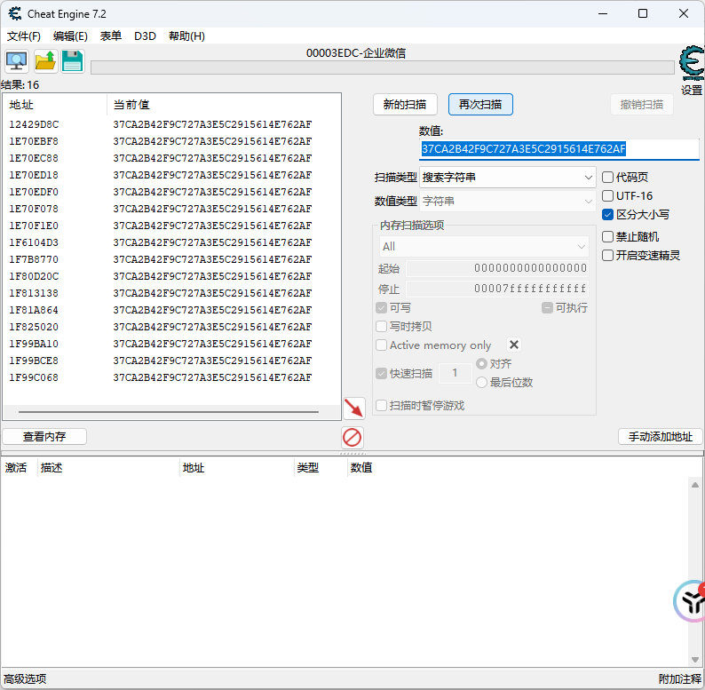

⚠️ **注意事项**：
- 初次搜索可能返回多个结果
- 通过刷新二维码来筛选有效地址
- 建议重复操作2-3次以减少干扰

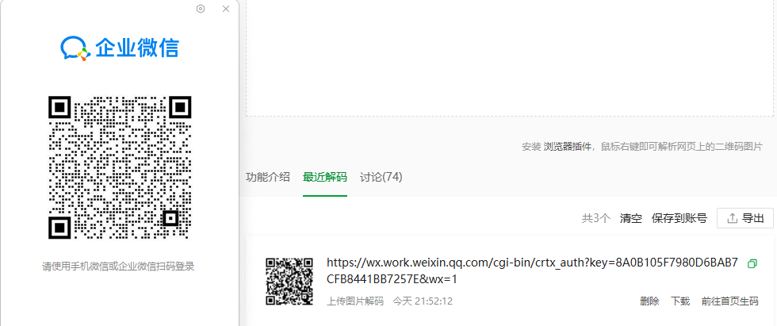

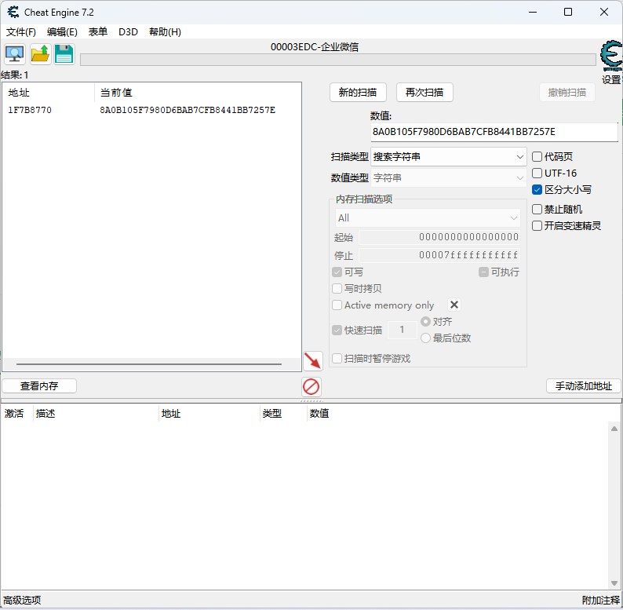

**步骤3：基址定位与断点设置**

使用指针扫描器定位基址，或通过硬件访问断点分析：

参考资料：[看雪论坛 - 登录二维码基址查找方法](https://bbs.kanxue.com/thread-286468.htm)

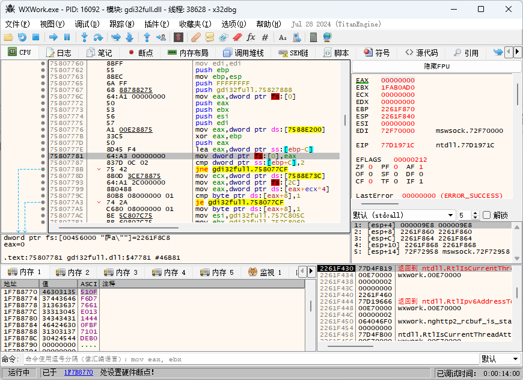

**步骤4：调试器分析**

使用x32dbg等调试器进行动态分析：

1. 对目标内存地址设置硬件写入断点
2. 触发二维码更新操作
3. 观察断点触发时的执行流程

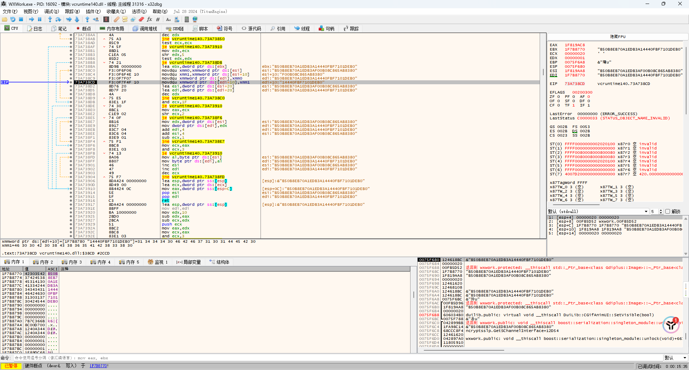

**步骤5：函数回溯分析**

通过堆栈回溯分析上层调用函数：

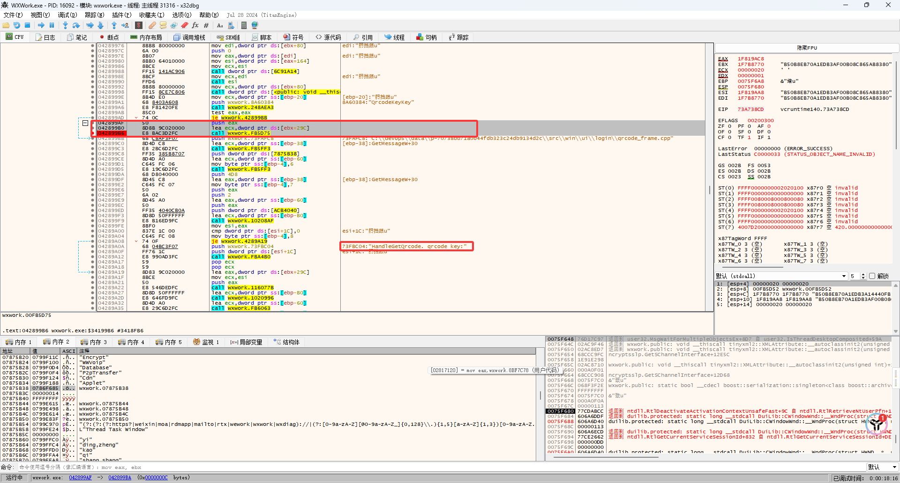

定位到二维码处理函数后，可以进一步分析：

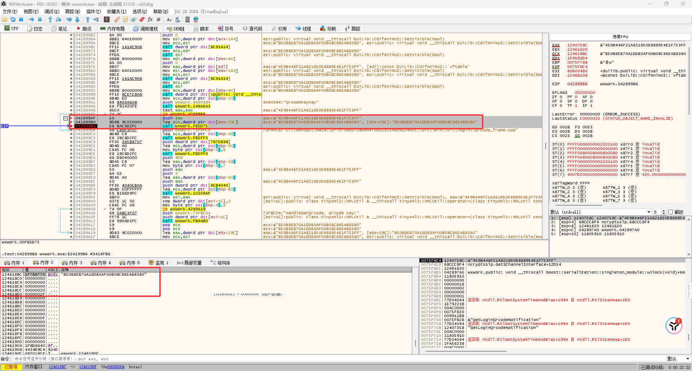

### 2.3 文件监控方案

### 2.3.1 方案原理

文件监控方案基于一个重要发现：企业微信在生成二维码时会将图像文件保存到特定目录。

**关键特征**：
- 存储路径：`%USERPROFILE%\Documents\WXWork\Global\Image`
- 文件格式：UUID格式的JPG文件（如：`xxxxxxxx-xxxx-xxxx-xxxx-xxxxxxxxxxxx.jpg`）
- 生成时机：每次刷新二维码时创建新文件

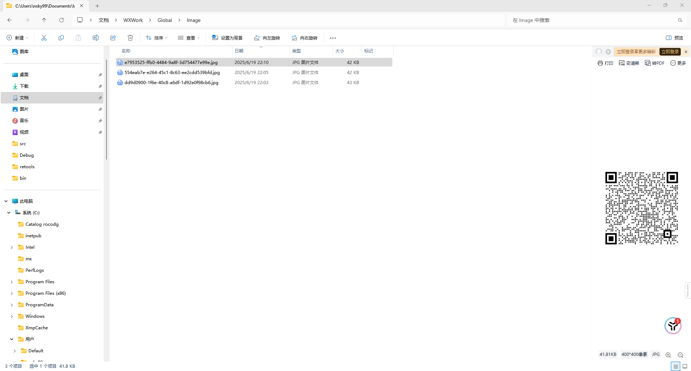

### 2.3.2 实现策略

**策略1：实时监控**
- 使用文件系统监控API
- 实时检测新文件创建
- 自动识别二维码内容

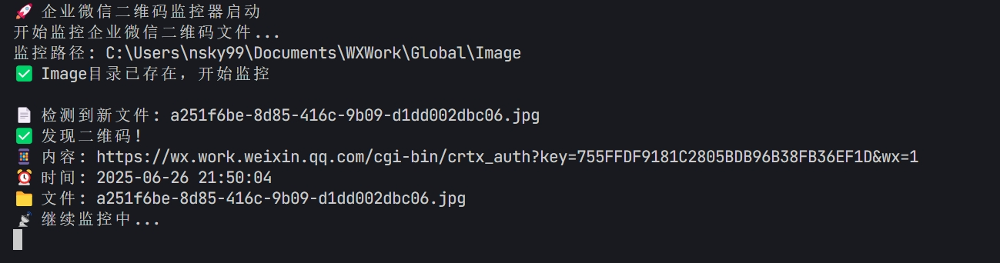

**策略2：定时扫描**
- 定期扫描目录
- 获取最新修改的文件
- 适用于批量处理场景

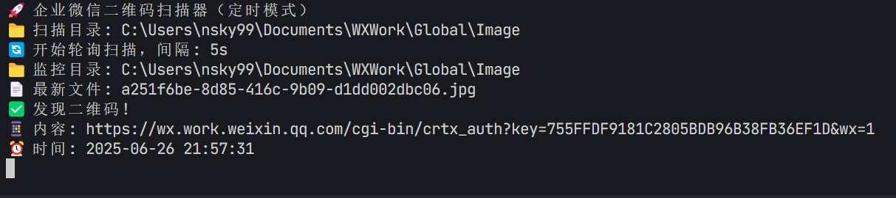

### 2.4 窗口截图方案

### 2.4.1 方案原理

窗口截图方案通过直接捕获企业微信窗口内容来获取二维码，具有以下优势：
- **通用性强**：不依赖特定的文件存储机制
- **实时性好**：可以实时捕获当前显示的二维码
- **兼容性佳**：适用于不同版本的企业微信

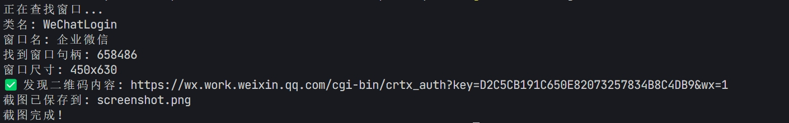

## 方案对比与选择

### 技术方案对比

| 方案 | 技术难度 | 实现复杂度 | 稳定性 | 检测风险 | 适用场景 |
| --- | --- | --- | --- | --- | --- |
| **逆向工程** | ⭐⭐⭐⭐⭐ | 极高 | 低 | 高 | 深度研究、学习目的 |
| **文件监控** | ⭐⭐⭐ | 中等 | 高 | 低 | 自动化监控、批量处理 |
| **窗口截图** | ⭐⭐ | 简单 | 高 | 极低 | 快速获取、通用性强 |

## 快速开始指南

## 总结

本文详细介绍了获取企业微信登录二维码的三种技术方案，从逆向工程的深度分析到文件监控的自动化处理，再到窗口截图的简便实用，每种方案都有其独特的优势和适用场景。

### 核心要点

1. **技术多样性**：提供了从简单到复杂的多种技术路径，满足不同用户需求
2. **安全合规**：所有方案都应在合法合规的前提下使用，严格遵守相关法律法规
3. **实用导向**：推荐优先使用窗口截图方案，简单可靠且风险较低
4. **持续维护**：随着软件版本更新，需要持续维护和优化代码
5. **学习价值**：通过技术研究提升逆向工程和系统编程能力

### 注意事项

⚠️ **重要提醒**：
- 本文档仅供技术学习和研究使用
- 请在合法授权的环境中进行测试
- 不得将相关技术用于任何非法用途
- 使用过程中请注意数据安全和隐私保护

通过本文的学习，读者可以根据自己的技术水平和实际需求，选择最适合的实现方案，并在实践中不断完善和优化。希望这些技术方案能够为相关的学习和研究工作提供有价值的参考。